# OpenProject — refonte UI/UX

Fork d'[OpenProject](https://github.com/opf/openproject) 17.8 dont l'interface
a été reconstruite, dans l'esprit de Plane CE.

Une contrainte a été tenue d'un bout à l'autre : **aucune fonctionnalité
retirée**. Les pages d'origine ne sont pas supprimées, elles sont rangées —
chaque navigation reconstruite garde une section « Vues classiques » repliée
qui y mène. Tout ce qui est disponible sans licence Enterprise reste
accessible.

Quinze écrans ont été reconstruits : contrôleur propre, vue propre, feuille de
style propre. Ce n'est pas un thème posé sur l'existant.

---

## Avant / après

Les captures « origine » viennent d'une instance OpenProject **vierge** montée
pour l'occasion, et non de l'instance modifiée : photographier l'ancien contenu
dans la nouvelle coquille n'aurait rien prouvé. Mêmes données de démonstration
des deux côtés.

### Accueil

| Origine | Refonte |
| --- | --- |
| 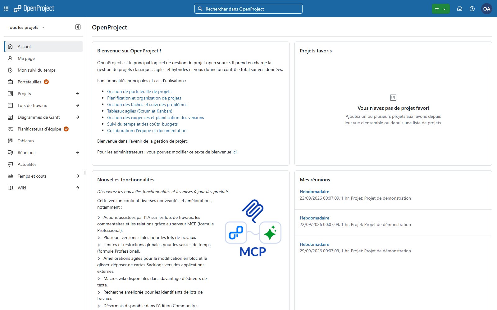 | 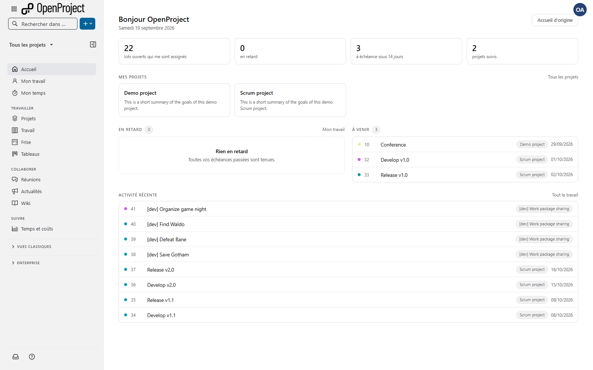 |

L'accueil d'origine présente le produit. Celui-ci ouvre la journée : retards,
échéances proches, projets suivis.

### Travail

| Origine | Refonte |
| --- | --- |
| 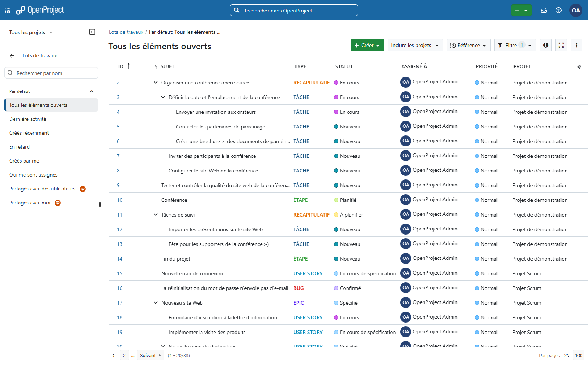 | 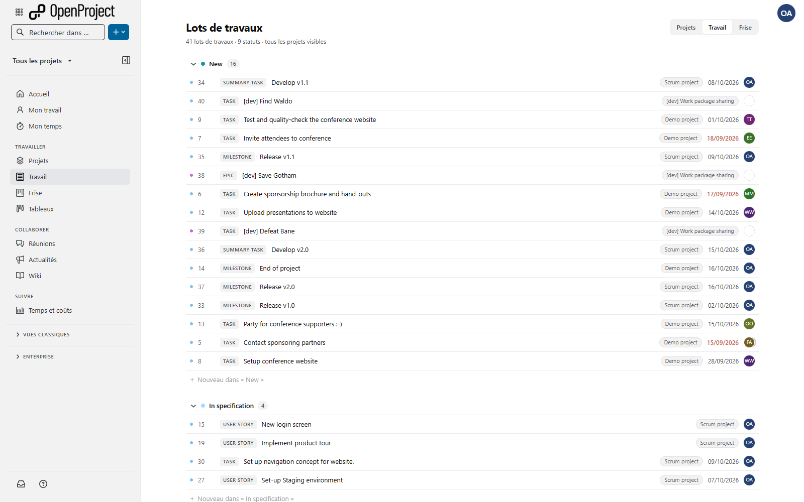 |

Groupé par statut, une ligne par lot, création au pied de chaque groupe. La
table filtrable d'origine reste accessible — elle porte l'export, les colonnes
configurables et les vues enregistrées.

### Frise

| Origine | Refonte |
| --- | --- |
| 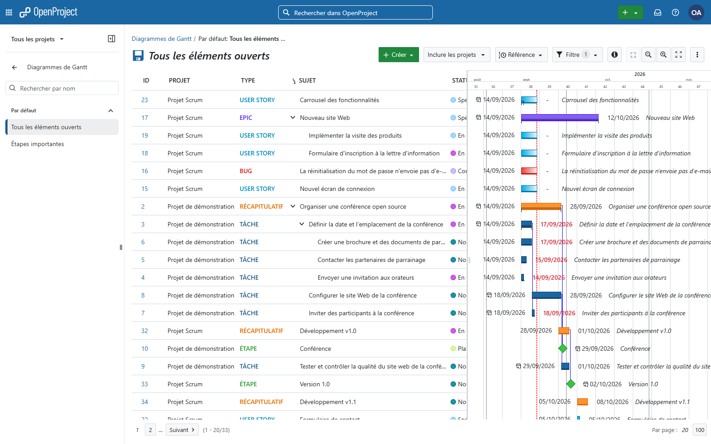 | 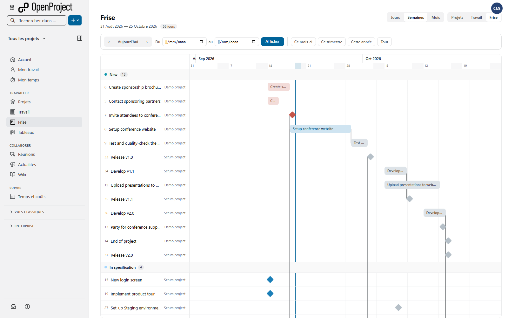 |

Construite de zéro : grille CSS, dépendances tracées côté serveur, libellés
dans les barres, sélecteur de période, barre de défilement horizontale propre.

### Projets

| Origine | Refonte |
| --- | --- |
| 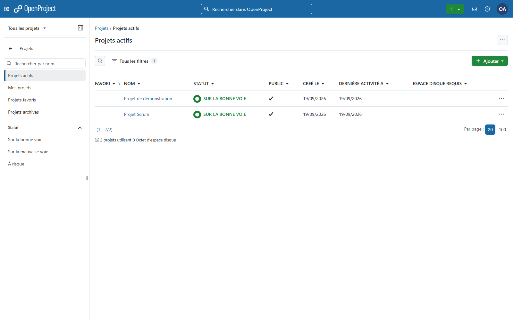 | 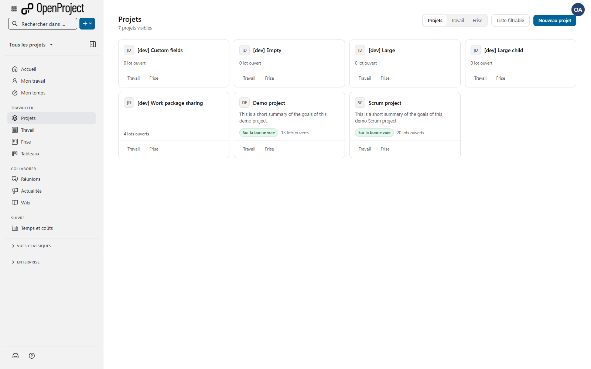 |

Des cartes pour entrer dans un projet. Le tableau d'origine sert à comparer des
colonnes ; il reste à un clic.

### Mon temps

| Origine | Refonte |
| --- | --- |
| 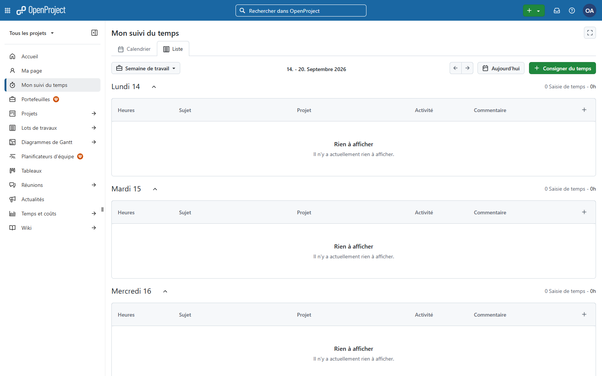 |  |

La semaine entière, jour par jour, avec les jours ouvrés sans saisie signalés.
L'original n'affiche qu'un jour — or on complète son temps en fin de semaine.

### Wiki

| Origine | Refonte |
| --- | --- |
| 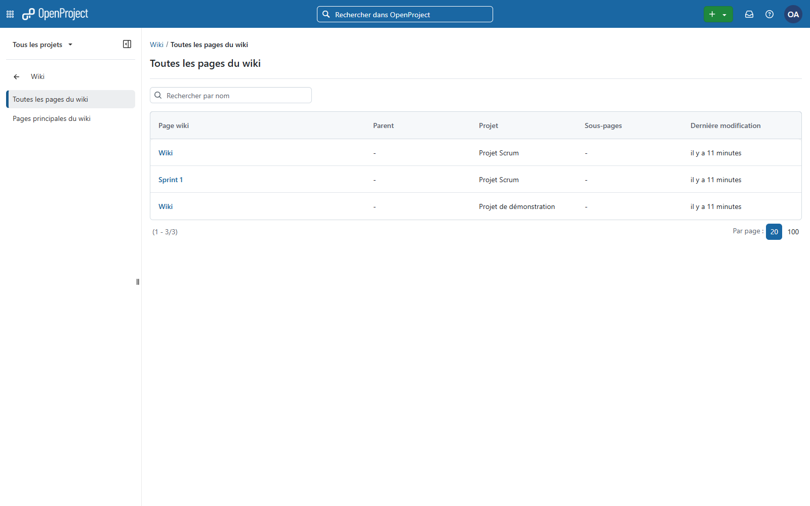 | 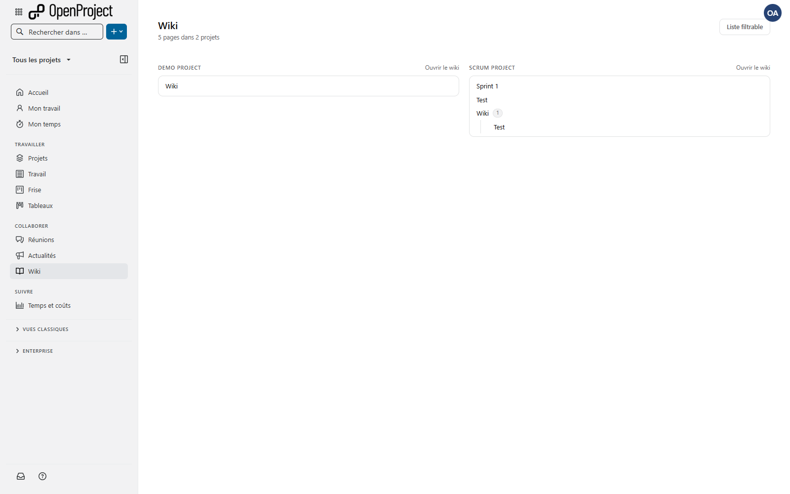 |

Un arbre par projet, parents et enfants. L'entrée globale d'origine rend une
liste plate.

### Menu de création

| Origine | Refonte |
| --- | --- |
| 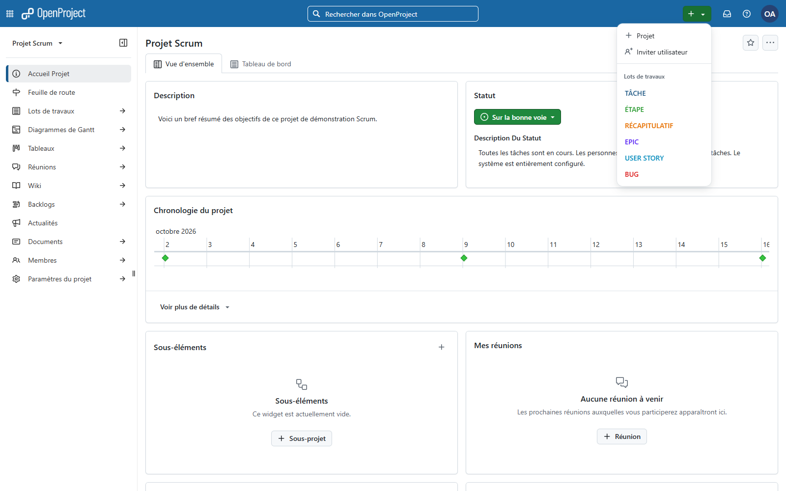 | 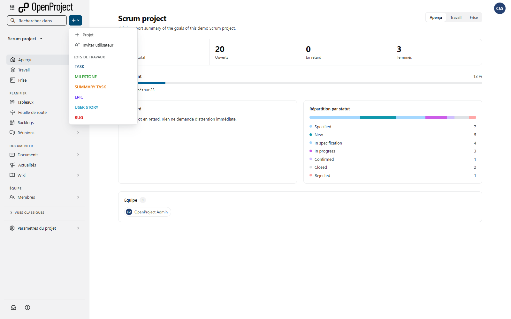 |

Descendu du bandeau dans la latérale et refait à plat. Le composant d'origine
empile trois niveaux par entrée, dont plusieurs reçoivent un fond au survol :
on voyait deux surbrillances emboîtées sur une même ligne.

Les deux thèmes, clair et sombre, sont traités.

---

## Les quinze écrans

Les pages reconstruites occupent les **adresses canoniques**. Les pages
d'origine restent servies, sous `/legacy`.

| Écran | Adresse | Page d'origine |
| --- | --- | --- |
| Accueil | `/` | `/legacy` |
| Mon travail | `/my/page` | `/legacy/my/page` |
| Mon temps | `/my/time-tracking` | `/legacy/my/time-tracking` |
| Projets | `/projects` | `/legacy/projects` |
| Travail | `/work_packages` | `/legacy/work_packages` |
| Frise (Gantt) | `/gantt` | `/legacy/gantt` |
| Tableaux | `/boards` | `/legacy/boards` |
| Réunions | `/meetings` | `/legacy/meetings` |
| Actualités | `/news` | `/legacy/news` |
| Wiki | `/wiki_pages` | `/legacy/wiki_pages` |
| Temps et coûts | `/cost_reports` | `/legacy/cost_reports` |

Et en portée projet :

| Écran | Adresse | Page d'origine |
| --- | --- | --- |
| Aperçu | `/projects/:id` | `/legacy/projects/:id` |
| Travail | `/projects/:id/work_packages` | `/legacy/projects/:id/work_packages` |
| Frise | `/projects/:id/gantt` | `/legacy/projects/:id/gantt` |

Travail et Frise existent en deux portées servies par le **même code**
(`PlaneScope`) : sans `project_id`, la page bascule sur l'ensemble des lots
visibles, et chaque ligne porte alors le nom de son projet.

### Les vues enregistrées ne sont pas capturées

`/work_packages` ne sert pas qu'un index : avec `?query_id=` ou
`?query_props=`, il sert une **vue enregistrée** — ce sont les sous-entrées du
menu, « Tous les éléments ouverts », « En retard », « Mes projets »…

La page reconstruite ne répond donc que sur l'**adresse nue**. Dès qu'un
paramètre de vue est présent, la requête continue jusqu'au contrôleur
d'origine. Sans cette précaution, toutes ces vues auraient été cassées en
silence : l'utilisateur aurait vu la page reconstruite au lieu de la sienne,
sans la moindre erreur.

Même principe pour les liens profonds : `/work_packages/42`,
`/work_packages/details/...` et tout le routage client d'Angular sont
intacts — seul l'index exact est repris.

## Autres changements

- **Modale de confirmation maison** à la place de `window.confirm`, branchée sur
  `Turbo.config.forms.confirm`. Toutes les navigations internes passent par elle.
- **Invitation de plusieurs personnes en une fois**, par sélection multiple ou
  par collage d'une liste d'adresses (virgule, point-virgule, retour à la
  ligne). Un échec n'annule pas les autres.
- **Navigation réorganisée** en sections thématiques, avec les entrées
  Enterprise non activées repliées plutôt que masquées.

## Ce qui n'a pas été reconstruit, et pourquoi

- **Le canevas des tableaux** (colonnes, glisser-déposer, mise à jour en direct)
  reste celui d'OpenProject : composant Angular avec de l'état temps réel, le
  réécrire à moitié ferait perdre des fonctions. Seul l'index a été refait.
- **Le générateur de rapports de coûts** reste d'origine, pour la même raison :
  groupements libres, colonnes, export. La page reconstruite donne la réponse
  immédiate et renvoie vers lui.
- **`beforeunload`** reste la boîte native du navigateur. Les navigateurs
  l'imposent délibérément pour empêcher un site de retenir l'internaute ; aucun
  site ne peut la remplacer.

## Points d'entrée du code

```
app/controllers/plane_*.rb                        les onze contrôleurs reconstruits
app/controllers/concerns/plane_scope.rb           portée projet ou transverse
app/views/plane_*/                                les vues
app/views/layouts/_plane_*.html.erb               coquille, navigation, menu de création
app/helpers/plane_*.rb                            regroupement des menus, chemins
frontend/src/global_styles/layout/_plane_*.sass   thème et pages
frontend/src/turbo/plane-confirm.ts               modale de confirmation
config/initializers/plane_routes.rb               reprise de la racine d'un projet
```

Les commentaires expliquent le *pourquoi* et documentent les pièges rencontrés :
cascade CSS contre Primer, géométrie de la frise et alignement des connecteurs,
conventions non documentées d'OpenProject pour greffer une page.

## Lancer

```bash
cp .env.example .env                                        # ajuster PORT, DEV_UID, DEV_GID
cp docker-compose.override.yml.example docker-compose.override.yml
docker compose up -d db cache backend worker frontend
```

L'application répond sur le `PORT` du fichier `.env`.

Ne lancez pas `docker compose up -d` sans arguments : les conteneurs de test
démarrent avec, et l'échec de l'un d'eux interrompt l'ensemble.

### Mémoire

Le compose amont lance le serveur Angular avec 8 Go de tas Node. Sur une machine
de développement ordinaire, le noyau tue le conteneur sous la charge d'une
recompilation — et la page devient blanche sans la moindre erreur applicative,
ce qui rend la panne difficile à diagnostiquer. Le fichier d'override ramène ce
plafond à 3 Go, ce qui suffit très largement.

### Où placer les sources

Elles sont montées dans les conteneurs par un *bind mount*. Sous Windows,
gardez-les sur `C:` : Docker Desktop y partage nativement.

Un emplacement dans une distribution WSL demande en revanche que l'intégration
WSL soit activée pour cette distribution précise (Docker Desktop → Settings →
Resources → WSL Integration). Sans elle, le démon reste joignable mais **ne
partage aucun fichier** : les conteneurs montent un dossier vide et échouent sur
`Could not locate Gemfile`, sans que rien n'indique la cause réelle.

---

## Amont, licence et crédits

Ce dépôt est dérivé d'[OpenProject](https://github.com/opf/openproject),
logiciel libre publié par OpenProject GmbH sous **GNU GPL v3**. Cette refonte
est distribuée sous la même licence. Voir [LICENSE](LICENSE) et
[COPYRIGHT](COPYRIGHT).

La documentation, le suivi des bogues et la communauté d'OpenProject restent les
références pour tout ce qui ne relève pas de cette refonte :

- Documentation : <https://www.openproject.org/docs/>
- Dépôt amont : <https://github.com/opf/openproject>
- Divulgation de vulnérabilité :
  [statement on security](docs/security-and-privacy/statement-on-security/README.md)

L'historique amont n'est pas présent dans ce dépôt : le clone de travail était
superficiel (`--depth`). Le premier commit est un instantané de l'arbre amont au
commit `2d1ae9c1`, le second porte l'intégralité de la refonte —
`git diff HEAD~1 HEAD` la montre donc exactement.

### Icônes

Thanks to Vincent Le Moign and his fabulous Minicons icons on
[webalys.com](http://www.webalys.com/minicons/icons-free-pack.php).

### Police d'icônes OpenProject

Published and created by the OpenProject Foundation (OPF) under
[Creative Commons Attribution 3.0 Unported License](http://creativecommons.org/licenses/by/3.0/)
with icons from the following sources
[Minicons Free Vector Icons Pack](http://www.webalys.com/minicons) and
[User Interface Design framework](http://www.webalys.com/design-interface-application-framework.php)
both by webalys.

OpenProject Icon Font by the OpenProject Foundation (OPF) is licensed under
Creative Commons Attribution 3.0 Unported License and free for both personal and
commercial use. You can copy, adapt, remix, distribute or transmit it, under this
condition: provide a mention of the "OpenProject Foundation" and a link back to
OpenProject www.openproject.org.
